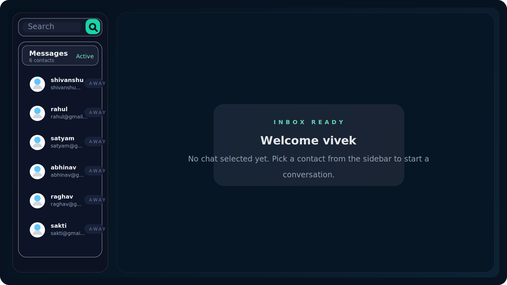

# ChatApp

A full-stack real-time chat application built with the MERN stack, Socket.IO, and a modern React + Vite frontend. It supports user authentication, one-to-one conversations, live online presence, and an interface designed for fast everyday messaging.



## Overview

ChatApp is a lightweight messaging platform where authenticated users can sign up, log in, browse available contacts, and exchange messages in real time. The project is split into a React frontend and an Express/MongoDB backend connected through REST APIs and Socket.IO events.

## Key Features

- Secure signup and login flow with JWT cookie-based authentication
- Real-time messaging powered by Socket.IO
- Online user tracking and live presence updates
- Contact list with quick search experience
- Persistent chat history stored in MongoDB
- Responsive interface built with React, Tailwind CSS, and DaisyUI

## Tech Stack

**Frontend**

- React 18
- Vite
- Tailwind CSS
- DaisyUI
- Axios
- Zustand
- React Router
- Socket.IO Client

**Backend**

- Node.js
- Express
- MongoDB with Mongoose
- Socket.IO
- JWT
- bcryptjs
- cookie-parser
- CORS

## Project Structure

```text
chatapp-master/
|-- Backend/
|   |-- controller/
|   |-- jwt/
|   |-- middleware/
|   |-- models/
|   |-- routes/
|   |-- SocketIO/
|   `-- index.js
|-- Frontend/
|   |-- public/
|   |-- src/
|   |   |-- components/
|   |   |-- context/
|   |   |-- home/
|   |   `-- zustand/
|   `-- vite.config.js
`-- README.md
```

## Getting Started

### 1. Clone the repository

```bash
git clone <your-repo-url>
cd chatapp-master
```

### 2. Install dependencies

```bash
cd Backend
npm install
```

```bash
cd ../Frontend
npm install
```

### 3. Configure environment variables

Create a `.env` file inside `Backend/`:

```env
PORT=4001
MONGODB_URI=your_mongodb_connection_string
JWT_SECRET=your_jwt_secret
ALLOWED_ORIGINS=http://localhost:3001
NODE_ENV=development
```

Optional frontend variables can be added to `Frontend/.env` if needed:

```env
VITE_API_BASE_URL=http://localhost:4001
VITE_SOCKET_URL=http://localhost:4001
```

## Run Locally

Start the backend:

```bash
cd Backend
npm run dev
```

Start the frontend:

```bash
cd Frontend
npm run dev
```

Default local URLs:

- Frontend: `http://localhost:3001`
- Backend: `http://localhost:4001`

## API Highlights

- `POST /api/user/signup` - register a new user
- `POST /api/user/login` - authenticate an existing user
- `POST /api/user/logout` - clear auth session
- `GET /api/user/allusers` - fetch other registered users
- `GET /api/message/:id` - fetch conversation messages
- `POST /api/message/send/:id` - send a message to a user

## Real-Time Flow

- User logs in and receives authenticated access
- Frontend connects to Socket.IO with the logged-in user ID
- Backend tracks active sockets and broadcasts online users
- Messages are stored in MongoDB and instantly emitted to the receiver if online

## Why This Project Stands Out

- Clean separation between frontend and backend
- Real-time communication with practical Socket.IO usage
- Authentication, persistence, and chat presence in one project
- Good base for adding group chat, media sharing, typing indicators, or deployment

## Future Improvements

- Group conversations
- Typing indicators
- Message read receipts
- Avatar upload support
- Message timestamps and delivery states
- Deployment guides for Vercel and Render

## Author

Created by **Akhilesh**.

If you want, I can also help turn this into a portfolio-ready README with deployment badges, live demo links, and a contribution section.
